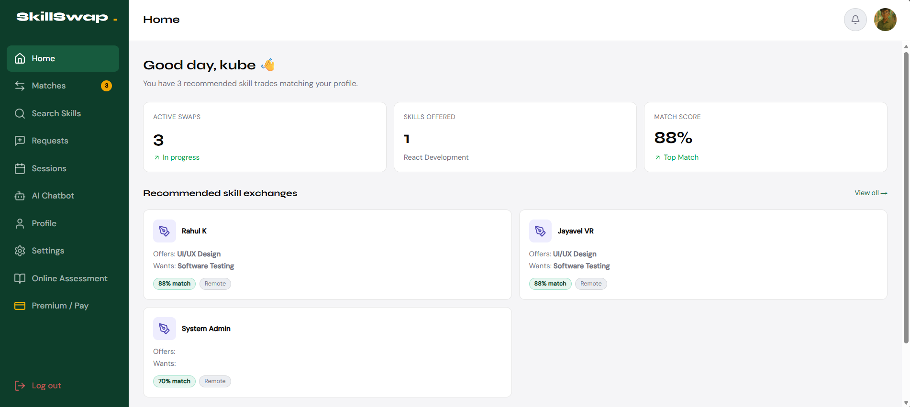
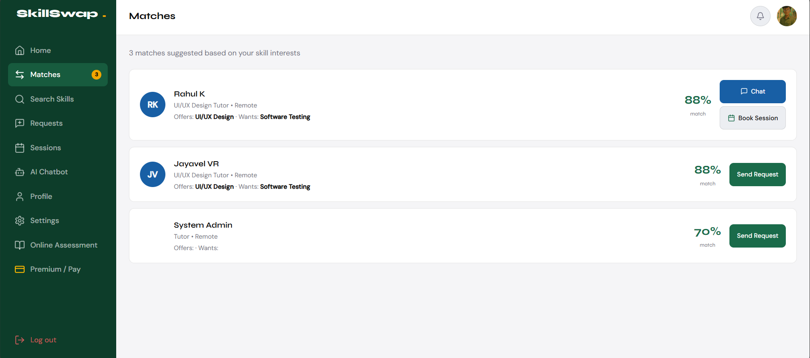
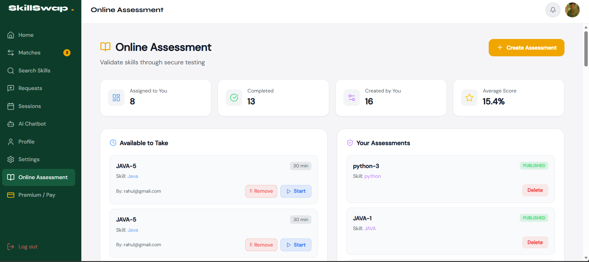
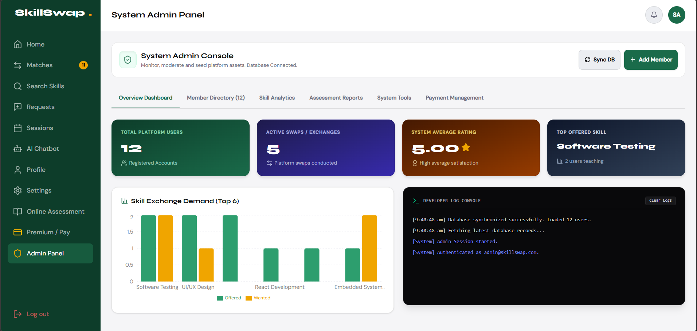
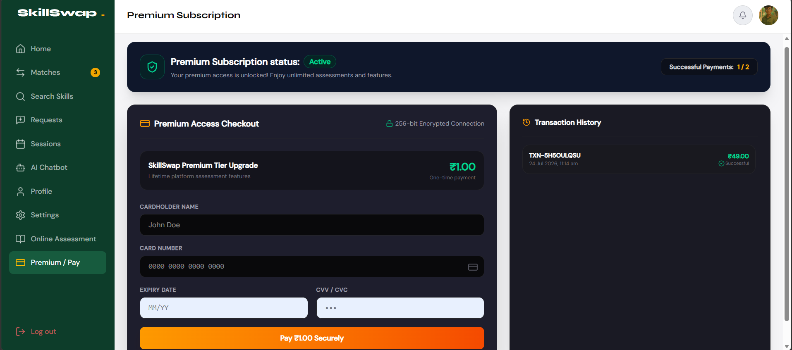

# 🚀 Skill Swap – Skill Assessment & Exchange Platform

Skill Swap is a full-stack web application that enables users to share skills, create and attempt assessments, communicate with other users, and access premium assessment features.

## ✨ Features

- 🔐 User Authentication & Role-Based Access
- 👤 User Profile & Skill Management
- 🔄 Skill Sharing & Exchange
- 📝 Assessment Creation & Assignment
- 🎯 Assessment Attempt & Evaluation
- 🔒 Secure Assessment Mode
- 💎 Premium Assessment Access
- 👨‍💼 Admin-Controlled Premium Management
- 💳 Razorpay Payment Gateway Integration
- 💬 Real-Time Communication
- 📊 User & Assessment Management
- 🛡️ Admin Access Control

## 🛠️ Technologies Used

### Frontend
- HTML
- CSS
- JavaScript

### Backend
- Java
- Spring Boot
- REST API
- Spring Security
- JWT

### Database
- MongoDB Atlas

### Payment
- Razorpay

### Development Tools
- Git
- GitHub

## 🔐 Security

- JWT-based authentication
- Role-based authorization
- Protected APIs
- Admin-only premium management
- Secure assessment mode
- Assessment violation tracking
- Secure payment verification

## 💎 Premium Assessment

Premium access allows users to access extended assessment features.

The Admin controls:

- Assessment creation access
- Assessment writing access
- Free user limits
- Premium user limits
- Premium access settings

## 💳 Payment

Razorpay Payment Gateway is integrated for premium membership payments.

Payment status is verified through the backend before granting premium access.

> Note: Payment functionality depends on the configured Razorpay environment.

## 📸 Screenshots

Add screenshots of:

- Home Page

- User Dashboard

- Assessment Page

- Admin Panel

- Payment Page

## 🌐 Live Demo

https://skill-swap-rs7n.vercel.app/

## 📂 Repository

https://github.com/yuvadhesh/SkillSwap

## 🚀 Future Enhancements

- AI-based skill recommendations
- Advanced assessment analytics
- Certificate generation
- Skill verification
- Leaderboard and achievements

## 👨‍💻 Developer

**Yuvadhesh Maran**

Skill Swap was developed as a personal full-stack project to gain practical experience in Java, Spring Boot, MongoDB Atlas, REST APIs, authentication, authorization, and payment gateway integration.